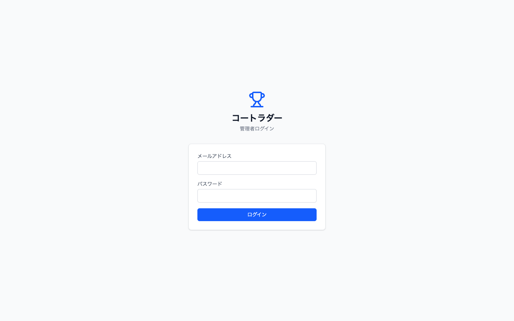
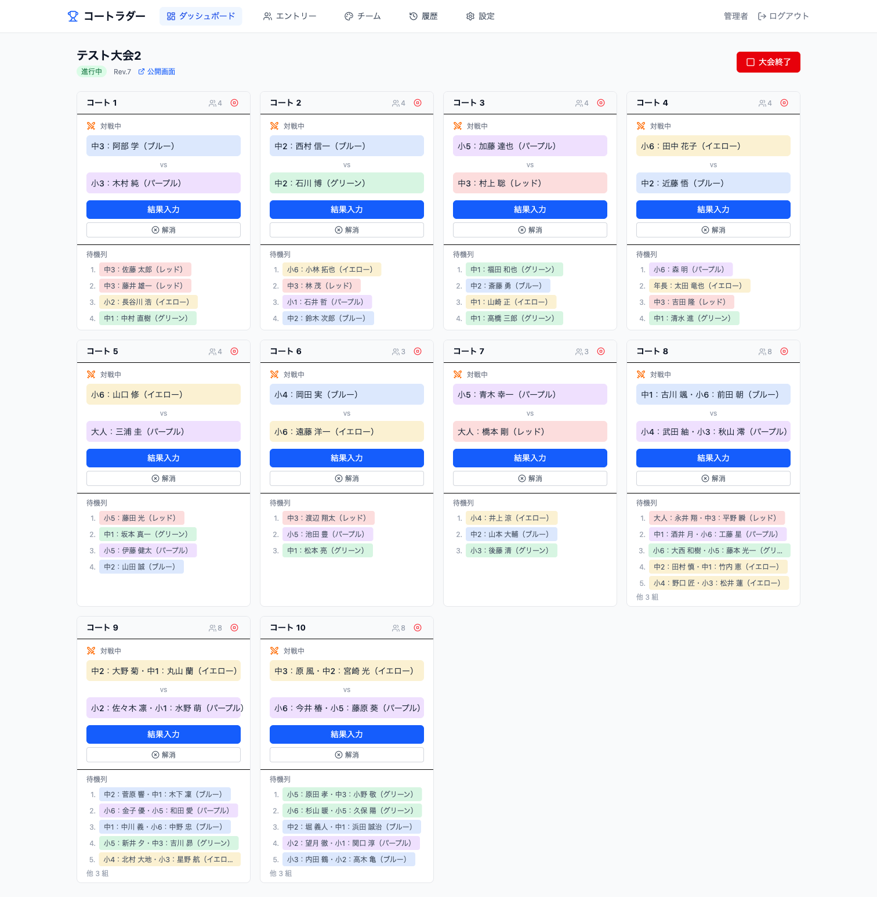
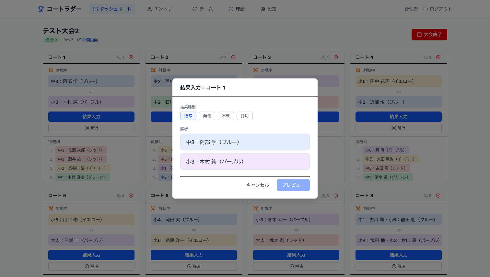
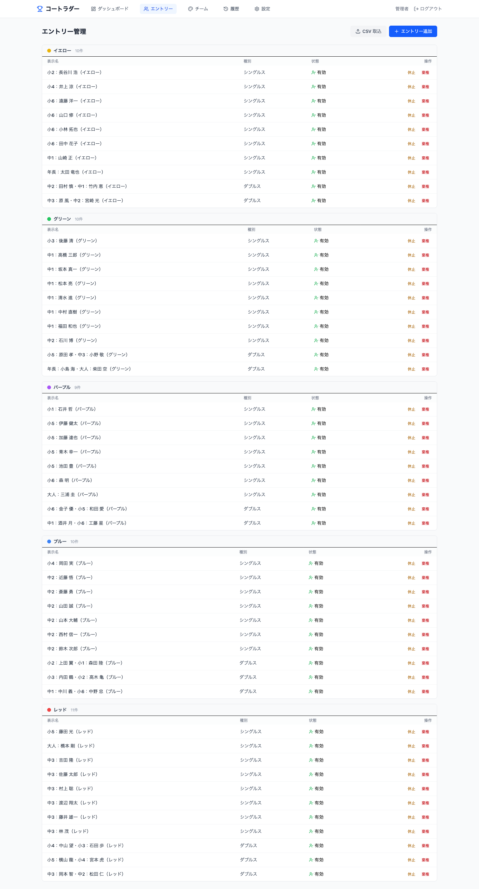
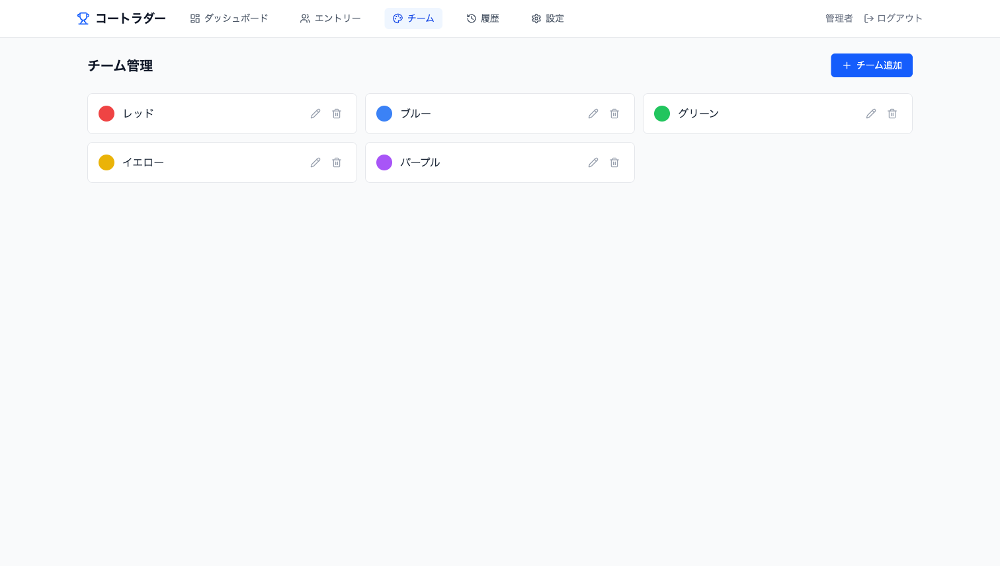
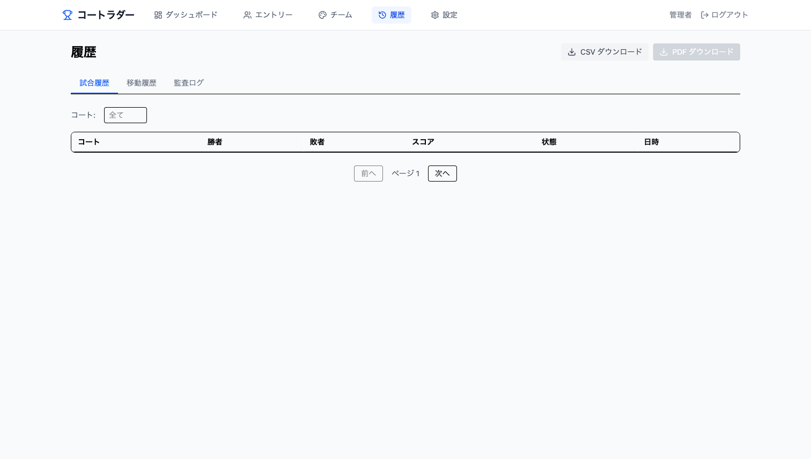
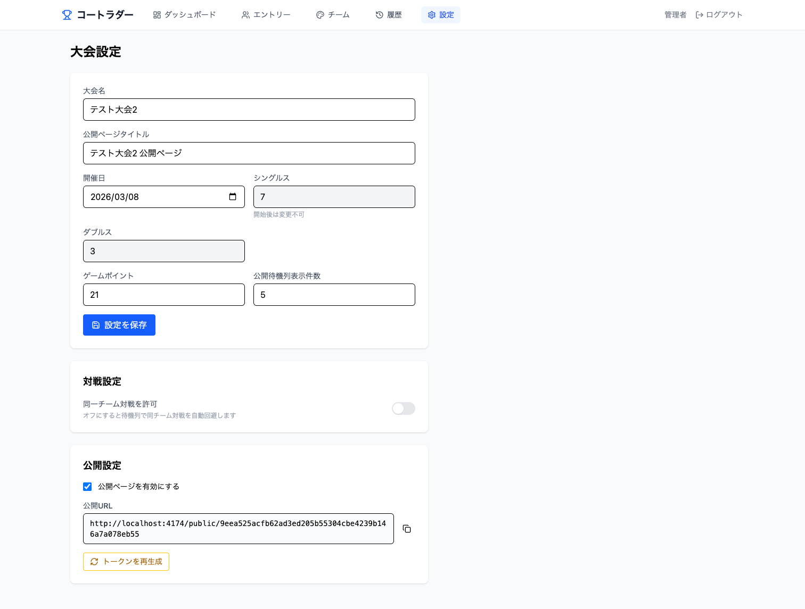
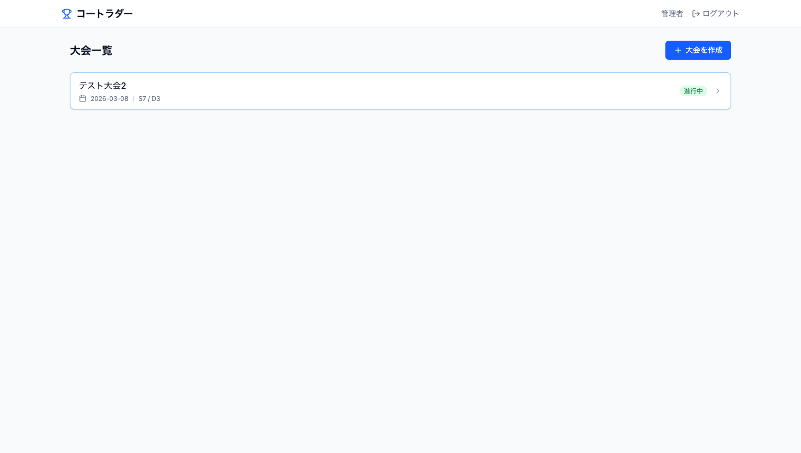

# コートラダー

バドミントンの勝ち上がり負け落ち進行管理 Web システム。

## スクリーンショット

### ログイン


### 管理ダッシュボード


### 結果入力ダイアログ


### エントリー管理


### チーム管理


### 試合履歴


### 大会設定


### 大会一覧


## 機能

- コート管理（シングルス/ダブルス分離、停止/再開）
- 待機列管理（同一チーム対戦回避、自動試合生成）
- 結果入力（通常/棄権/不戦/打ち切り）と勝ち上がり・負け落ち自動移動
- 結果取り消し（直前1件、元の待機列位置に復元）
- 結果再入力（完了済み試合のスコア・勝敗修正）
- リクエスト試合（管理者が手動作成、移動処理なし）
- ドラッグ&ドロップによるコート間エントリー移動
- 公開画面（認証不要、リアルタイム更新）
- CSV 一括登録、PDF/CSV エクスポート
- 監査ログ

## 技術スタック

| レイヤー | 技術 |
|---|---|
| Frontend | React + Vite + TypeScript + Tailwind CSS |
| Backend | Supabase Edge Functions (Deno/TypeScript) |
| Database | Supabase PostgreSQL |
| Auth | Supabase Auth (JWT) |
| Realtime | Supabase Realtime (Postgres Changes) |
| Deploy (Frontend) | Vercel |
| Deploy (Backend) | Supabase |

## プロジェクト構成

```
court_ladder/
├── frontend/               # React SPA
│   ├── src/
│   │   ├── components/     # UI コンポーネント
│   │   ├── pages/          # ページコンポーネント
│   │   ├── hooks/          # カスタムフック
│   │   ├── lib/            # ユーティリティ
│   │   ├── contexts/       # React Context
│   │   └── types/          # TypeScript 型定義
│   ├── vercel.json         # Vercel SPA ルーティング設定
│   └── vite.config.ts
├── supabase/
│   ├── functions/          # Edge Functions
│   │   ├── _shared/
│   │   │   ├── core/       # 純粋関数（業務ロジック）
│   │   │   ├── auth.ts     # 認証ヘルパー
│   │   │   ├── db.ts       # DB クライアント
│   │   │   ├── audit.ts    # 監査ログ
│   │   │   └── response.ts # レスポンスヘルパー
│   │   ├── admin-matches/  # 試合 API
│   │   ├── admin-courts/   # コート API
│   │   ├── public-api/     # 公開 API
│   │   └── ...
│   └── migrations/         # DB マイグレーション
├── tests/core/             # Deno ユニットテスト
├── spec.md                 # 仕様書 (v2.7)
├── er_api.md               # ER 図・API 設計書
└── CLAUDE.md               # 開発ルール
```

## セットアップ

### 前提条件

- Node.js 20+
- Deno
- Supabase CLI

### ローカル開発

```bash
# Supabase ローカル起動
supabase start

# フロントエンド
cd frontend
npm install
npm run dev
```

開発サーバー: http://localhost:5173

### テスト実行

```bash
# コアロジックのユニットテスト
$HOME/.deno/bin/deno test tests/core/
```

### デプロイ

**Frontend (Vercel)**

Vercel にリポジトリを接続し、Root Directory を `frontend` に設定。

環境変数:
- `VITE_SUPABASE_URL` - Supabase プロジェクト URL
- `VITE_SUPABASE_ANON_KEY` - Supabase anon key
- `VITE_API_BASE_URL` - Edge Functions の URL (`https://<project>.supabase.co/functions/v1`)

**Backend (Supabase)**

```bash
# Edge Functions デプロイ
supabase functions deploy

# マイグレーション適用
supabase db push
```

## 仕様書

- `spec.md` - 機能仕様書 v2.7
- `er_api.md` - ER 図・API 設計書 v2.5
